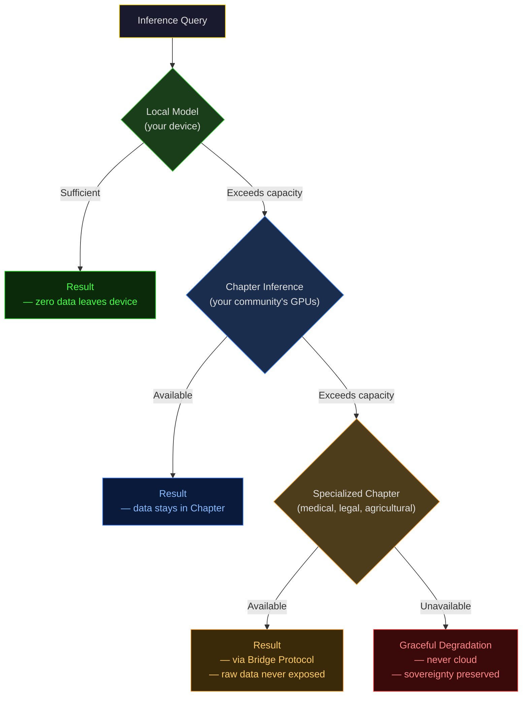

# The Membrane Agent: Your Last Line of Defense Against the Genies You Didn't Summon

---

## The Lamp Is Not Yours

Every app on your phone is a genie. Cheap wishes; infinite scroll; instant gratification. We covered this in [The Genie Problem](/blog/2026-01-25-the-genie-problem-why-virtue-based-systems-fail-in-abundance/): when technology fulfills desires cheaply and safely, nobody refuses. The old scarcity-based virtues evaporate. Patience dissolves in same-day delivery. Faith collapses under algorithmic certainty. Delayed gratification becomes irrational when the genie grants wishes *now*.

The essay diagnosed the disease. This article prescribes the treatment.

But first, the part everyone gets wrong: **the genie is not the problem.** Technology that fulfills desires is not inherently destructive. Agriculture was a genie. Printing was a genie. Antibiotics were a genie. Nobody mourns the scarcity those genies eliminated.

The problem is simpler, and darker.

**The lamp is not yours.**

Your phone's AI assistant does not work for you. It works for the company that wrote its inference weights. Your recommendation algorithm does not optimize for your wellbeing. It optimizes for engagement metrics that translate into advertising revenue. Your smart home does not protect your family. It harvests behavioral data for a cloud server in Virginia that you will never audit.

Every "AI assistant" on the market today is a *double agent*. It serves you just enough to maintain the illusion of loyalty, while its actual principal sits in a boardroom you will never enter.

This is not a bug. This is the business model.

---

## The Alignment Problem Nobody Talks About

The AI safety community spends billions debating whether a future superintelligence might destroy humanity. Meanwhile, the actually-deployed AI systems are already doing something worse: they are *domesticating* humanity. Slowly. Comfortably. With your explicit consent, clicked through in a terms-of-service agreement you never read.

The real alignment problem is not "Will GPT-7 decide to kill us?"

The real alignment problem is: **Whose interests does the AI on your device actually serve?**

If your AI assistant is hosted on someone else's cloud, trained on someone else's data, optimized for someone else's metrics, and updated at someone else's discretion, then it is not *your* AI. It is their AI, running on your hardware, wearing your face.

Consider what a truly sovereign AI assistant would look like:

- It runs **locally**. On your device. No cloud dependency. No phone-home telemetry.
- It serves **your** interests. Not an advertiser's. Not a platform's. Not a government's.
- It filters **for you**. Against spam, against manipulation, against the ocean of AI-generated slop that is drowning the open internet.
- It negotiates **on your behalf**. With other AI agents, with services, with strangers, *before you ever need to be involved*.
- It grows **with you**. Learning your patterns, your preferences, your trust graph, over years, not sessions.

This is not a product pitch. This is an architectural specification. And it already has a name.

---

## The Membrane Agent: Sovereign Intelligence at the Edge

In the Libertaria protocol stack, the **Membrane Agent** sits at Layer 1, the identity and trust layer called *The Hull*. It is the cognitive skin of your personal submarine, the boundary between you and the untrusted ocean of the open network.

The submarine metaphor is not decorative. It is architectural.

A submarine operates in hostile territory by default. Everything outside the hull is pressure, darkness, and potential threats. The hull does not *hope* the ocean is friendly. The hull *assumes* hostility and filters accordingly. What passes through the membrane has earned passage, through cryptographic proof, through social verification, through computational expenditure.

The Membrane Agent is this hull made intelligent.

### Three Brains, One Filter

The Membrane Agent operates through a three-layer triage system modeled on neuroscience, not because it is fashionable, but because it maps to the actual computational requirements of real-time filtering:

**The Reptilian Layer** handles what can be decided in microseconds. Whitelists. Blacklists. Rate limits. Known-good packets pass. Known-bad packets die. No intelligence required, pure pattern matching at wire speed. Cost: near zero.

**The Limbic Layer** handles what requires context. Graph proximity checks: *how far is this sender from someone I trust?* Behavioral heuristics: *does this message pattern look like spam, like a probe, like a coordinated attack?* Entropy verification: *did the sender pay the computational cost to prove they are not a Sybil?* This is where RFC-0115's Pattern Detection System operates, aggregating temporal windows, detecting attack signatures, autonomously adjusting difficulty levels without human intervention.

**The Cognitive Layer** handles what requires actual intelligence. Novel contacts. Ambiguous signals. Content that passed the first two layers but feels *off*. This is where local AI inference runs, a small model on your device, evaluating whether the message from that stranger three hops away in your trust graph contains signal or noise.

The key insight: **99% of all traffic dies at the Reptilian Layer.** The Limbic Layer handles most of the remainder. The Cognitive Layer fires rarely, and only for edge cases worth the computational cost. This is why it runs on a Raspberry Pi. This is Kenya Compliance.

### The Airlock Protocol

Between the untrusted ocean and your attention sits the **Airlock**, a three-stage quarantine that the Quasar Vector Lattice (RFC-0120) specifies as the default filtering model:

**Stage 1, The Outer Hull:** Did you pay the entropy cost? Every message entering the network must carry an Entropy Stamp, a proof-of-work that makes bulk spam economically unviable. A single message costs fractions of a second. A million messages costs *days*. The economics kill spam before the filter even engages.

**Stage 2, The Inner Hull:** Do I know you? The trust graph is checked. If the sender is within your social distance, within the web of vouched-for relationships that constitute your personal reputation network, the message moves inward. If not, it enters quarantine.

**Stage 3, The Periscope:** Is there signal in this noise? For messages from strangers that passed entropy verification but have no trust path, the Explorer module evaluates content. Local AI inference. Pattern matching against known manipulation templates. Relevance scoring against your stated interests. The Explorer recommends, the Membrane decides.

What reaches your attention has survived all three stages. Not censored, *curated*. By an agent that serves you and only you.

---

## But Where Does the Intelligence Come From?

Here is where Libertaria's architecture diverges from every centralized AI system on the market.

Your Membrane Agent runs local inference. A small model, optimized for filtering, pattern detection, and social navigation. It lives on your device. It trains on your data. It never phones home.

But small models have limits. Sometimes you need more power than a Raspberry Pi can provide.

The centralized answer: send your data to the cloud. Let OpenAI or Google or Anthropic run the inference. Accept the surveillance tax.

The Libertaria answer: **Chapter Inference.**

Every Chapter, every self-governing community in the Libertaria federation, can run inference infrastructure for its members. A Chapter in Frankfurt with surplus GPU capacity serves its members' complex inference needs. A Chapter in Nairobi optimized for low-bandwidth operation provides lightweight models tuned for Kenya-class devices.

The critical difference: **the Chapter serves its members, not advertisers.** Chapter governance is subject to exit pressure. If a Chapter monetizes its members' inference data, members leave. Portable reputation means they lose nothing by leaving. The competitive dynamics of federated governance create structural incentives for honest service.

And if even Chapter Inference is insufficient, specialized Chapters exist. A Chapter dedicated to medical inference. A Chapter dedicated to legal analysis. A Chapter dedicated to agricultural forecasting. You query their inference services through the Bridge Protocol (RFC-0260), paying in Energy Tokens or Time-Bond Tokens, receiving results without ever exposing your raw data.

**Local first. Chapter second. Specialized third. Cloud never.**

The fallback cascade ensures you always have intelligence available, with sovereignty preserved at every layer.

---

## The Four Pillars, Guarded

The Membrane Agent is not a feature. It is the **first contact interface** for every pillar of a decentralized society. Nothing reaches you without passing through the membrane. This makes it the single most valuable piece of infrastructure in the entire stack.

### Communication: The Feed Without the Feed

Social media's original promise: connect with people you care about. Social media's actual function: maximize engagement through emotional manipulation, outrage amplification, and addictive design patterns.

The Membrane Agent inverts this. Your Feed (RFC-0830) is curated by *your* agent, not an algorithm optimized for advertiser revenue. Your agent knows your trust graph. It knows which voices you value. It knows the difference between information that serves you and content designed to hijack your limbic system.

No advertisements. No data harvesting. No attention merchants. The Chapter's law is absolute on this point: **human lives must not be turned into capital.** Your Membrane Agent enforces this the way a castle wall enforces a border, not through policy, but through physics.

The AI slop that is drowning the open internet, the generated articles, the synthetic influencers, the bot armies, dies at Stage 1. The entropy cost alone kills volume attacks. What passes is human signal, verified, vouched for, earned.

### Law: Agent-to-Agent Negotiation

Before you ever need a court, your Membrane Agent negotiates with other agents. The Agent-to-Agent handshake protocol (RFC-0010 §10) allows agents to establish terms, resolve minor conflicts, and set boundaries, *without human involvement*.

The stalker scenario from [Ritter](/stories/ritter/) is the paradigm case. Tobias's proximity pattern triggers Lena's Membrane Agent. Ritter negotiates directly with Tobias's agent. The behavior adjusts. No human embarrassment. No public confrontation. No lawyers.

Scale this to contracts, to service agreements, to Chapter governance disputes. Your agent represents your interests in automated negotiations, escalating to human attention only when the stakes justify it. The 99% of minor frictions that currently clog courts and consume human attention are handled at machine speed, by agents that know their principals' preferences.

### Production: Resource Discovery Without Platforms

Decentralized production requires coordination. Who has surplus capacity? Who needs materials? Where is the nearest fabrication workshop with the right specifications?

These are namespace queries (RFC-0500). Your Membrane Agent publishes your capabilities and subscribes to relevant resource channels, all through the ns-msg system that unifies distributed communication under a single semantic. The agent filters incoming offers through your trust graph. Spam dies. Scams die. What reaches you is verified supply meeting genuine demand.

No platform takes a 30% cut. No algorithm buries your listing because you didn't pay for promotion. The coordination layer is sovereign, running on the same protocol as everything else.

### Finance: The Last Firewall

Peer-to-peer settlement operates without banks. This is powerful. It is also dangerous. Without the Membrane Agent, financial transactions are exposed to phishing, social engineering, and the full spectrum of crypto scams that have drained billions from unsophisticated users.

The Membrane Agent is the last firewall. It verifies counterparty identity through the trust graph. It checks transaction parameters against your established patterns. It flags anomalies before you commit irreversible transfers. It maintains audit logs anchored to the settlement layer.

Your money moves without intermediaries. But it does not move without *your agent's* verification. The difference between "your keys, your coins, your problem" and "your keys, your coins, your agent's vigilance."

---

## Ritter: The Proof of Concept

In the story [Ritter](/stories/ritter/), a Membrane Agent is placed beside a six-year-old girl's bed. Forty-seven grams of silicon with two capabilities: listen and learn. Over twenty-two years, it grows with her. It slays cupboard dragons. It filters her Feed. It negotiates with a stalker's agent. It stands beside her at her wedding.

Ritter is fiction. The architecture is not.

Every capability Ritter demonstrates maps to a specified RFC:

- Dragon slaying → Agent-to-human trust building, personality calibration
- Feed curation → RFC-0830 tier filtering, Entropy Stamp verification
- Stalker resolution → RFC-0010 §10 Agent-to-Agent negotiation
- Lifelong growth → Substrate-based Memory Core, portable identity

The story is the *vision*. The RFCs are the *engineering*. The gap between them is implementation time, not architectural uncertainty.

---

## The Sting

Every AI company on the planet is building agents. Apple Intelligence. Google Gemini. Microsoft Copilot. Anthropic's Claude. They are all, without exception, building agents that serve the *company* first and the *user* second. They must. Their business models require it. Advertising revenue, API fees, data harvesting, platform lock-in, these are not optional for publicly traded corporations. They are fiduciary obligations.

You will never get a sovereign AI agent from a corporation whose revenue depends on your dependency.

The Membrane Agent is not better technology. It is better *alignment*. An agent that runs on your hardware, trained on your data, governed by your Chapter, answerable to nobody but you.

The genie is out. The wishes are being granted. The only question that matters: **who holds the lamp?**

If you do not control your own AI agent, someone else's AI agent controls you. There is no middle ground. There is no "opt out." The genies are already deployed. The only choice is whether you summon your own, or serve theirs.

> **Protocol is physics. Chapter is politics.**
> **Your submarine. Your membrane. Your reality tunnel.**
> **Point it wisely.**

---

*For technical implementation details, consult: RFC-0110 Membrane Agent Protocol, RFC-0115 Membrane Pattern Detection, RFC-0120 Quasar Vector Lattice, RFC-0830 Feed Social Protocol.*

*For the emotional reality of what this architecture produces when it works, read [Ritter](/stories/ritter/).*

*The genie is out. Build your own lamp.*

**⚡️**
